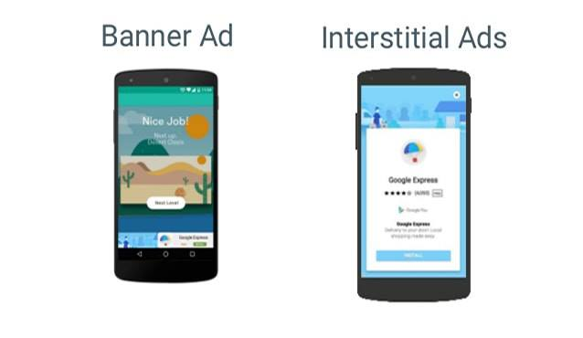

<head>

<!-- Primary Meta Tags -->
<title>အွန်လိုင်းပေါ်မှာ ငွေဘယ်လို ရှာမလဲ?</title>
<meta name="title" content="အွန်လိုင်းပေါ်မှာ ငွေဘယ်လို ရှာမလဲ?">
<meta name="description" content="အွန်လိုင်းပေါ် ကနေ ငွေဘယ်လိုရှာမလဲ? (Google Admob)">

<!-- Open Graph / Facebook -->
<meta property="og:type" content="website">
<meta property="og:url" content="https://aungkoman.github.io/making-money-online-part1/">
<meta property="og:title" content="အွန်လိုင်းပေါ်မှာ ငွေဘယ်လို ရှာမလဲ?">
<meta property="og:description" content="အွန်လိုင်းပေါ် ကနေ ငွေဘယ်လိုရှာမလဲ? (Google Admob)">
<meta property="og:image" content="https://aungkoman.github.io/images/social-preview/social-preview-making-money-part1.png">

<!-- Twitter -->
<meta property="twitter:card" content="summary_large_image">
<meta property="twitter:url" content="https://aungkoman.github.io/making-money-online-part1/">
<meta property="twitter:title" content="အွန်လိုင်းပေါ်မှာ ငွေဘယ်လို ရှာမလဲ?">
<meta property="twitter:description" content="အွန်လိုင်းပေါ် ကနေ ငွေဘယ်လိုရှာမလဲ? (Google Admob)">
<meta property="twitter:image" content="https://aungkoman.github.io/images/social-preview/social-preview-making-money-part1.png">
</head>
အွန်လိုင်းပေါ် ကနေ ငွေဘယ်လိုရှာမလဲ? (Google Admob)
ငွေဘယ်လိုရှာမလဲ မပြောခင် သူများတွေ ငွေဘယ်လိုရနေလဲ ပြောပြပါမယ်။

ပထမတစ်ခုကတော့ Admob ပါ။ Admob ဆိုတာ Google ရဲ့ ကြော်ညာပလက်ဖောင်း တစ်ခု ဖြစ်ပါတယ်။ သူက Mobile App Developer တွေကို သူတို့ ရေးတဲ့ app တွေအတွက် ငွေပြန်ပေးတဲ့ ပလက်ဖောင်းပါ။ ဒီအတိုင်းကြီး ပြန်ပေးတာတော့ မဟုတ်ဘူးပေါ့။ ကိုယ်ရေးတဲ့ mobile app မှာ admob ကြော်ညာအတွက် နေရာတစ်ခု ပေးထားရပါတယ်။ ဒီကြော်ညာ တွေနဲ့ ကျွန်တော်တို့ အားလုံးလိုလို နီးစပ်ပြီးသားပါ။ သတိမထားမိလို့သာ ဖြစ်ပါလိမ့်မယ်။ တွေ့နေကြ ကြော်ညာ(၃) ခုရှိပါတယ်။

Banner and Interstitial Ads

ပထမ တစ်ခုက Banner Ads ပါ။ သူကတော့ ရှင်းပါတယ်။ app ရဲ့ အောက်ဆုံးဘားမှာ ထိုးထားတဲ့ ကြော်ညာပါ။

ဒုတိယ တစ်ခုက Intrestitial Ads ပါ။ သူကတော့ ကျွန်တော်တို့ ဂိမ်း လယ်ဗယ်တစ်ခု အောင်သွားတဲ့ အချိန်ပဲ ဖြစ်ဖြစ်၊ စာဖတ်နေရင်း နောက်တစ်မျက်နှာ ကနေ နောက်တစ်မျက်နှာ ကို ကူးတဲ့အခါပဲ ဖြစ်ဖြစ် မျက်နှာပြင်အပြည့် ကြားဖြတ်ဝင်လာတက်တဲ့ ကြော်ညာမျိုးကို ခေါ်တာပါ။

Reareded Video Ads

တတိယ တစ်ခုကတော့ Reward Video ပါ။ သူကတော့ ဒဲ့ကို ကြော်ညာကြည့်ခို်ငးတဲ့ သ‌ဘောပါပဲ။ အတွေ့ရအများဆုံးကတော့ ဂိမ်းတွေမှာပါ။ သူ သတ်မှတ်တဲ့ ဂိမ်း item ကိုရဖို့ပဲဖြစ်ဖြစ် ကစားနေရင်း ပန်းတိုင်မရောက်ခင် သေသွားလို့ အသက်ဆက်ဖို့အတွက်ပဲဖြစ်ဖြစ် ကြော်ညာ ဗီဒီယို ကြည့်ရတာမျိုးတို့ပါ။

ဒီတော့ ကိုယ်ရဲ့ app အမျိုးအစားအပေါ် မူတည်ပြီး သင့်တော်တဲ့ ကြော်ညာအများအစားကို ထည့်ပြီး ငွေရှာလို့ရပါတယ်။ ကြော်ညာခကိုတော့ ကြည့်တဲ့ အကြိမ်အရေအတွက်ပေါ်မူတည်ပြီး ရပါတယ်။ အနိမ့်ဆုံး အဆင့်ဖြစ်တဲ့ Banner Adsကိုတောင် အကြိမ်အရေအတွက် တစ်ထောင် ပြပေးနို်ငရင် 1 USD အကြမ်းဖျဉ်းရပါတယ်။ နိုင်ငံအလိုက် ပေးတဲ့နှုန်း အနည်းအများကွာခြားနို်ငပါတယ်။ ဒီတော့ အသုံးပြုသူ တစ်ရာဉီးက ကိုယ့် app ကို ဆယ်မိနစ်လောက် ဖွင့်ကြည့်ရင် 1 USD ရမယ် ဆိုပါတော့။

ဆိုတော့ကာ ကိုယ်က App Developer မဟုတ်ဘူး မိုဘိုင်းအက်ပလီကေးရှင်းတွေ မရေးတက်ဘူးဆိုလည်း ကိစ္စမရှိပါဘူး။ ရေးတက်တဲ့ developer တစ်ယောက်ကို ငှားပြီး ကိုယ့်အတွက် App တစ်ခု ရေးခို်ငးလို့ရပါတယ်။ စျေးကတော့ ကိုယ့် ရဲ့ Idea ပေါ် မူတည်ပါတယ်။ ကိုယ်က ရိုးရိုး အဘိဓာန် အက်ပလီကေးရှင်းလောက် ရေးခိုင်းမှာလား၊ ဖေ့ဘွတ်ကဗီဒီယိုတွေ ဒေါင်းလုတ်လုပ်တဲ့ ဟာမျိုးလား၊ ဒါမှမဟုတ် သတင်းတွေ ဖတ်လို့ရတာမျိုးလား။ သောင်းဂဏန်းကနေ သိန်းဆယ်ချီထိ ရှိတက်ပါတယ်။

အဓိကကတော့ ကိုယ့်မှာ ဆန်းသစ်တဲ့ အတွေးအမြင်ရှိပြီး လူတွေလိုတဲ့ လူတွေ ကြုံတွေ့နေရတဲ့ ပြသနာကို ဖြေရှင်းပေးနိုင်တဲ့ app မျိုးဆိုရင် လူသုံးများလာမှာပါ။
