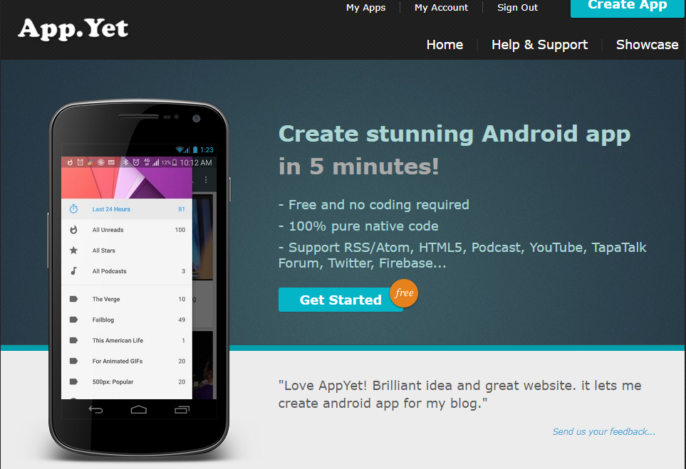
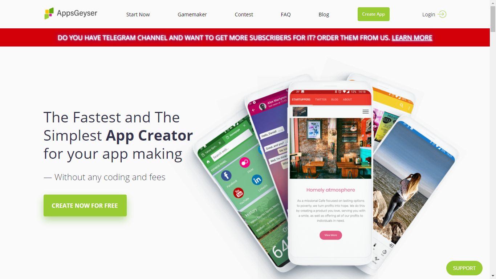

အွန်လို်ငးပေါ်ကနေ ငွေဘယ်လိုရှာမလဲ? အပိုင်း(၃) (for non tech people) Admob : part (3)

အရင် အပိုင်းတွေမှာ ရေးခဲ့တာက ပရိုဂရမ်မာတွေအတွက် ရည်ရွယ်ပြီး ရေးခဲ့တာ များတယ်။ ဒီတော့ ပရိုဂရမ်မာ မဟုတ်တဲ့သူတွေကရော Admob သုံးပြီးငွေရှာလို့ မရတော့ဘူးလားလို့ မေးစရာရှိလာတယ်။

ရပါတယ်။ ဉပမာ သင်က စာရေးဆရာ တစ်ယောက် ဆိုပါတော့။ ကိုယ်ရေးတဲ့ စာကို သဘောကျတဲ့ စာဖတ် ပရိတ်သတ်လည်း လုံလုံလောက်လောက်ရှိမယ်။ ကိုယ်ကလည်း စာရေးရတာကို ဝါသနာအရ အပြင် အပိုဝင်ငွေလည်း ရှာချင်တယ် ဆိုရင် admob က တဆင့် ငွေရှာလို့ရမယ့် နည်းလမ်း ရှိပါတယ်။ လူတိုင်း လူတိုင်းမှာ ကျွမ်းကျင်ရာ လိမ္မာရာ တစ်ခုခုတော့ ရှိကြတာပဲ မို့လား။ ကိုယ်ကျွမ်းကျင်တဲ့အရာနဲ့ လူတွေကို ကူညီရင်း အပိုဝင်ငွေလည်းရဆိုတော့ မကောင်းဘူးလားဗျာ။

သင်က စာရေးဆရာ ဆိုလည်း ကိုယ်ရေးတဲ့ စာတွေကို ဖတ်လို့မယ့် အက်ပလီကေးရှင်း၊ သင်က နည်းပညာအတိုအထွာလေးတွေ ပြန်ပြောပြပေးရတာ သဘောကျရင်လည်း နည်းပညာ လမ်းညွှန် ဘာညာသာရကာပေါ့။ ကိုယ်ကျွမ်းကျင်ရာ လိမ္မာရာ ကို ပြန်လည်မျှဝေပြီးတော့ အပိုဝင်ငွေ ရှာလို့ရပါတယ်။

အဲ့တာကတော့ ကိုယ့်အတွက် မိုဘိုင်းအက်ပလီကေးရှင်းတစ်ခု ထုတ်ပြီး ဖြန့်ချီတာပါပဲ။

ကိုယ့်ရဲ့ အက်ပလီကေးရှင်း ကတဆင့် ကိုယ်ရေးတဲ့စာတွေကို ဖတ်လို့ရမယ်။ သိမ်းထားလို့ရမယ်။ ရှာလို့ဖွေလို့ရမယ် စသည်ဖြင့်ပေါ့ ကိုယ့်ကို Facebook မှာ see first ပေးထားတာထက် ပိုပြီး ကိုယ့်စာတွေကို စနစ်တကျ ဖတ်လို့ရမယ် ဆိုပါတော့။ ဒီလို အခမဲ့ စနစ်တကျဖတ်လို့ရမယ့် အက်ပလီကေးရှင်းမှာ အပေါ်က ပြောခဲ့တဲ့ Admob က ကြော်ညာ ထည့်သွင်းပြီး အပိုဝင်ငွေ ပြန်ရှာလို့ရပါတယ်။

အခုခေတ်ကြီးမှာ သာမန် မိုဘိုင်းအက်ပလီကေးရှင်းတစ်ခု ရေးဖို့က အများကြီး မခက်တော့ပါဘူး။

coding လည်း သိစရာမလို ငွေလည်း ပေးစရာမလို့ပဲ အက်ပလီကေးရှင်းတစ်ခုကို မြန်မြန်ဆန်ဆန် အခမဲ့ ဖန်တီးပေးတဲ့ webiste တွေ ရှိပါတယ်။ အောက်မှာ နမူနာ နှစ်ခု ပေးထားပါတယ်။

https://www.appyet.com/

https://appsgeyser.com/

ဒါမှမဟုတ် အဖိုးအခ သက်သက်သာသာနဲ့ ရေးပေးတဲ့ နီးစပ်ရာ developer တစ်ဖွဲ့စီမှာလည်း အပ်လို့ရပါတယ်။ စျေးကတော့ ရေးပေးတဲ့ အဖွဲ့ နဲ့ ကိုယ်တောင်းဆိုတဲ့ feature အပေါ် မူတည်ပြီး သောင်းဂဏန်း ကနေ သိန်းဂဏန်းအထိ ကုန်ကျနိုင်ပါတယ်။ ဘယ်လောက် ပြန်ရနိုင်မလဲ ဆိုရင်တော့ ကိုယ့် app ကို အသုံးပြုတဲ့သူ အရေအတွက်အပေါ်မှာပဲ မူတည်ပါတယ် အပိုင်း(၁) မှာ ကြော်ညာခ ဘယ်လိုရတယ် ဆိုတာ ပြန်သွားဖတ်နို်ငပါတယ်။

လွယ်သလားမေးရင်တော့ မလွယ်ဘူးပေါ့ဗျာ။

နည်းပညာပိုင်းဆိုင်ရာ မလွယ်ဘူးပြောတာ မဟုတ်ဘူးဗျ ကိုယ့် content ရဲ့ အရည်အသွေးကောင်းဖို့ လူစိတ်ဝင်စားဖို့ လူတွေကို အကျိုးဖြစ်ထွန်းစေတဲ့တစ်ခုခု ဖန်တီးဖို့ ဆိုတာမျိုးကို ပြောတာ။

သာမန် Facebook သုံးတဲ့သူ တစ်ယောက်အနေနဲ့ ကိုယ်တင်တဲ့ post တစ်ခုတောင် react ကလေး ရာဂဏန်းပတ်လည်ရဖို့ မလွယ်ဘူးမို့လား။ cele တွေကိုတော့ မဆိုလိုပါဘူး :D။ ဒီတော့ ကိုယ့် content ကို အရည်အသွေးကောင်းဖို့ပဲ နဲ့ ဖတ်တဲ့သူတွေ အကျိုးဖြစ်ထွန်းဖို့ပဲ စေတနာထားပြီး လုပ်မယ်ဆိုရင်တော့ ရည်ရှည်မှာ အဆင်ပြေလာမယ် ထင်ပါတယ်။ ဒီတော့ ကိုယ့်မှာ ငွေတစ်ပြားမှ မရတောင် လုပ်ချင်နေတဲ့ အလုပ်ရှိမယ် passion ရှိမယ် ဆိုရင်တော့ ဒီလို app ထုတ်ပြီး ဖြန့်တာက ခင်ဗျားအတွက် အဆင်ပြေမှာပါ။