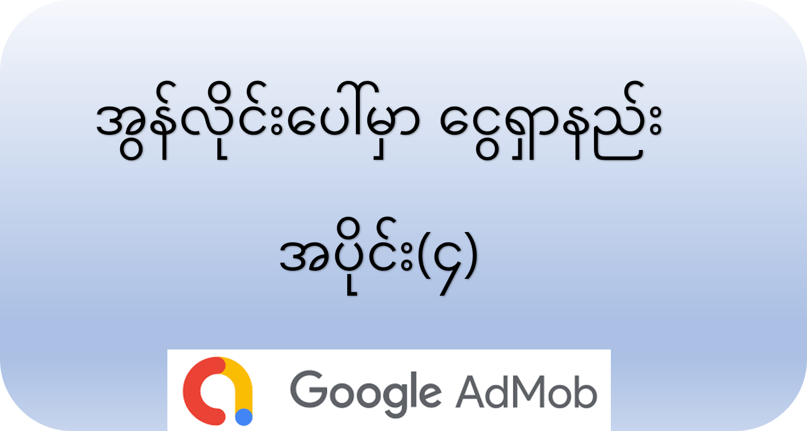

အွန်လိုင်းပေါ်ကနေ ငွေဘယ်လိုရှာကြမလဲ အပိုင်း(၄)

Admob မှာ မသိမဖြစ် သိထားသင့်တဲ့ ‌ဝေါဟာရ (၅) ခု
‌‌ငွေရှာလို့ရတဲ့ မှန်ကန်တဲ့နည်းတွေအများကြီးထဲကမှ ကျွန်တော်တို့နဲ့ နီးစပ်တဲ့ Google Admob အကြောင်းကို ပြောပြချင်ပါတယ်။

ပထမဆုံး Google Admob က ဘာလို့ ကျွန်တော်တို့ကို ပိုက်ဆံတွေ ပေးတာလဲဆိုတာကို အပိုင်း(၁) https://aungkoman.github.io/making-money-online-part1/ မှာ ရေးခဲ့ပါတယ်။

အပိုင်း(၂) https://aungkoman.github.io/making-money-online-part2/ မှာတော့ မြန်မာနို်ငငံကနေ Admob Account တစ်ခု ဖောက်ဖို့ ဘာတွေလိုမလဲ ဘယ်လိုပြင်ဆင်ရမလဲ ကြုံလာနို်ငတဲ့ အခက်အခဲတွေနဲ့ ဖြေရှင် ဖြေရှင်းနည်းတွေ ရေးခဲ့ပါတယ်။

ပရိုဂရမ်မာမဟုတ်တဲ့ သူတွေ အနေနဲ့ Admob က ငွေဘယ်လိုရနို်ငမလဲဆိုတာကိုတော့ အပိုင်း(၃) https://aungkoman.github.io/making-money-online-part3/ မှာ ဖတ်ရှုနိုင်ပါတယ်။

အခု အပိုင်း(၄) https://aungkoman.github.io/making-money-online-part4/ အနေနဲ့ ကျွန်တော့တို့ Admob မှာ ငွေရှာပြီဆိုရင် သိထားသင့်တဲ့ ဝေါဟာရ အခေါ်အဝေါ် (၅) မျိုးအကြောင်း ပြန်လည်မျှဝေပေးချင်ပါတယ်။

Admob ကို ဝင်ဝင်ချင်း dashboard မှာ အခုလို တွေ့ရမှာပါ

Admob Dashboard

1. Requests

Requests ဆိုတာကတော့ ကိုယ့်ရဲ့ app တွေကနေ admob ကို ကြော်ညာ ပြပေးဖို့ တောင်းဆိုတဲ့ အရေအတွက်ပဲ ဖြစ်ပါတယ်။ ဒါကတော့ ကိုယ့်ရဲ့ တောင်းဆိုတဲ့ ပုံစံအပေါ်မူ တည်ပြီး အနည်းအများရှိနို်ငပါတယ်။ ဉပမာ ကိုယ်က ads request ကို ရေးခဲ့တုန်းက no fill ပဲဖြစ်ဖြစ် error ပဲ ဖြစ်ဖြစ် ပြတာနဲ့ ချက်ခြင်း နောက်ထပ်အသစ်တစ်ခုတောင်းလို့ ရေးခဲ့မိမယ်ဆိုရင် request က များနေမှာပါ။ ကျွန်တော့ အလိုအရသာ ဆိုရင်တော့ ပရိုဂရမ်ရေးတဲ့ အချိန်ကတည်းက request လုပ်တဲ့ ပုံစံကို သတိထားပြီး ရေးခဲ့သင့်ပါတယ်။ ဟာ request များ ပြီးတာပဲ ကြော်ညာ ဖြည့်မပေးသမျှ တောက်လျှောက် loop ပတ်ပြီး တောင်းနေမယ် ဆိုတာမျိုးက ရေရှည်မှာ နောက်ထပ်ပြောမယ့် impression နဲ့ match rate အတွက် အဆင်ပြေမှာ မဟုတ်ပါဘူး။ ဆိုတော့ကာ request ကို ပုံမှန်အတို်ငးပဲ ပို့တာက match rate နဲ့ impression မှာ ပိုကောင်းတဲ့ အဆင့်ကို ရောက်စေပါလိမ့်မယ်။ နောက်တစ်ခု တစ်လက်စတည်း ပြောချင်တာက refresh interval ပါ။ ဉပမာ ဆိုကြပါဆို banner ads တစ်ခုပြပြီး နောက်ထပ် ဘယ်လောက်အကြာမှာ အသစ်တစ်ခု ထပ်တောင်းပြီး ပြမလဲဆိုတာကို developer ကိုယ်တို်င ဆုံးဖြတ်လည်း ရပါတယ်။ ဒါမှမဟုတ် Google က သူ့အတွက် အဆင်ပြေတဲ့ အချိန်အတိုင်းအတာ တစ်ခုအတွင်းမှာ အလိုအလျောက် refresh လုပ်ပြီး ကြော်ညာ အသစ် (impression အသစ်) ရအောင် လုပ်ပေးပါလိမ့်မယ်။ Google ကိုသာ ဆုံးဖြတ်ခို်ငးလိုက်ပါ။ :D

2. Impression

ဒီမှာ လာပါပြီ။ Impression ဆိုတာ ကြော်ညာ ပြပေးတဲ့ အရေအတွက်ကို ပြောတာပါ။ Impression 30 ဆိုရင် ဒါဟာ ကိုယ့် app တွေမှာ ကြော်ညာ (၃) ပြပြီးသွားပြီလို့ ဆိုလိုပါတယ်။ ကြော်ညာ က ဘယ်လိုအချိန်မှာ ပြလဲ? request လုပ်တို်ငး ကြော်ညာ ပြန်ပြပေးနေတာလား? no no no. မဟုတ်ပါဘူး။ Google ရဲ့ inventory မှာ ပြစရာကြော်ညာ ရှိနေဉီးမှ၊ နောက်ပြီး ကိုယ့်ရဲ့ request ကလည်း သူတို့ရဲ့ အမျိုးမျိုးသော စံနှုန်းတွေနဲ့ ကိုက်ညီ နေမှ သင့်တော်တဲ့ ကြော်ညာကို ပြပေးတာ ဖြစ်ပါတယ်။ ဒါကြောင့် ကိုယ့် app တွေက ကြော်ညာပြပေးဖို့ request တိုင်း ကြော်ညာ ပြပေးမယ်လို့ မျှော်လင့်လို့မရပါဘူး။

3. Match Rate

ရှင်းရှင်းပြောရရင်တော့ impression ကိုတည် request နဲ့စားပြီး တစ်ရာနဲ့ မြောက်တဲ့ ရာခို်ငနှုန်းပါပဲ။ ရှုပ်များသွားသလား :D ။ ဆိုလိုတာက ကိုယ် request လုပ်သမျှရဲ့ ဘယ်နှစ်ရာခို်ငနှုန်းကိုပဲ ကြော်ညာ ပြပေးလဲ ဆိုတာကို ပြပေးတာပါ။ ဉပမာ ကိုယ်က request တစ်ထောင် လုပ်တယ်။ ကြော်ညာ (impression) က ခုနှစ်ရာ ပဲ ပြပေးတယ် ။ ဒါဆို match rate က ၇၀ % ဖြစ်မှာပေါ့ ။ နားလည်မယ် ထင်ပါတယ်။

4. Est. earnings

Estimated earnings ကို ဆိုလိုတာပါ။ စောစောက ပြောခဲ့တဲ့ request တွေ၊ impression တွေ အရ အခု ကိုယ့်အတွက် ငွေဘယ်လောက်ရနိုင်ပါတယ်ဆိုတာကို Google က ခန့်မှန်းတွက်ချက်ပေးထားတာပါ။ ပုံမှာ ပြထားတဲ့ နမူနာ အရဆိုရင် request က 15.6 K, impression က 5.96 K , ရနို်ငတဲ့ ငွေက 0.63 USD လို့ ပြောရမှာပါ။

5. eCPM

Effective cost per thousand impressions ။ impression တစ်ထောင်မှာ ငွေဘယ်လောက်ရနိုင်တယ်ဆိုတာက ပြောတဲ့ အညွှန်းကိန်းပါ။ ပုံမှန် ဆိုရင်တော့ impression တစ်ထောင်ကို 1 USD ရှိပါတယ်။ ဒါပေမယ့် ကိုယ့် app ကိုအသုံးပြုတဲ့သူတွေရဲ့ နိုင်ငံ၊ ကိုယ့် app ရဲ့ အရည်အသွေး စတာတွေအပေါ် မူတည်ပြီး အတိုးအလျော့ ရှိပါတယ်။ အခု နမူနာမှာ ပြထားတာ ဆိုရင် မြန်မာနိုင်ငံက app တွေပါ။ Impression ၁၀၀၀ မှာ 0.11 USD ပဲ ရပါတယ်။ xo sad ပါ :D ။ စိတ်ဓာတ်မကျပါနဲ့။ အစပိုင်းတော့ အများကြီးမပေးဘူးပေါ့ဗျာ။ နောက်ပိုင်းတော့ ရမလာမှာပါ တစ်ခုခုပေါ့ :P။

ကဲ ဒီလောက်ဆိုရင် Admob Dashboard ကိုကြည့်ပြီး ပေကြောင် ပေကြောင် ဖြစ်မနေတော့ဘူးလို့ ထင်ပါတယ်။ ကိုယ်သိထားတာဖြစ်ဖြစ်၊ သိချင်တာဖြစ်ဖြစ် အောက်က comment box မှာ ဖြည့်စွက်/မေးမြန်း ခဲ့လို့ရပါတယ်