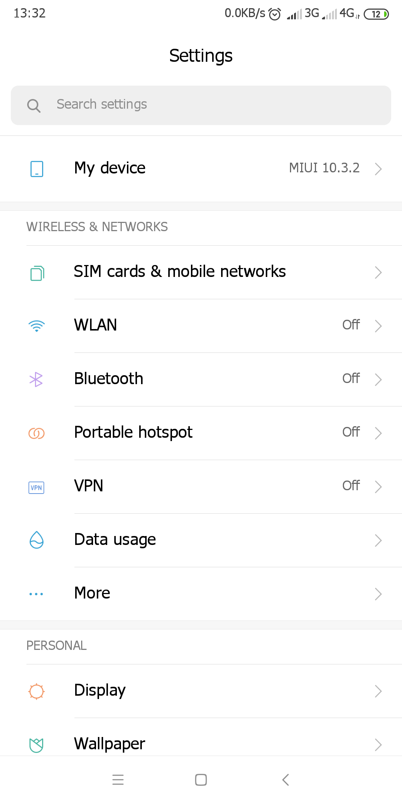
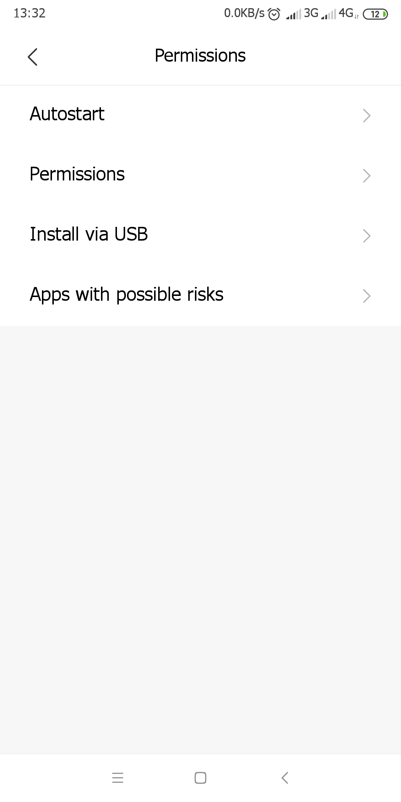
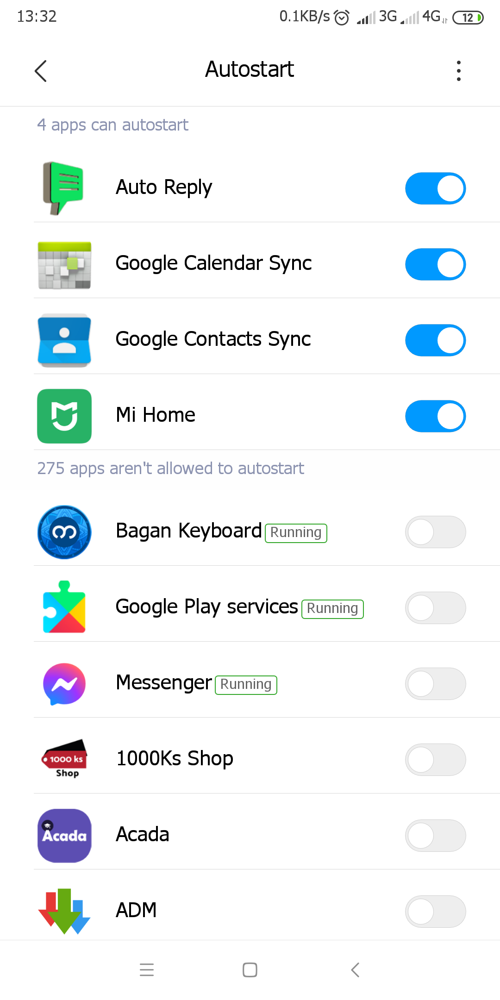
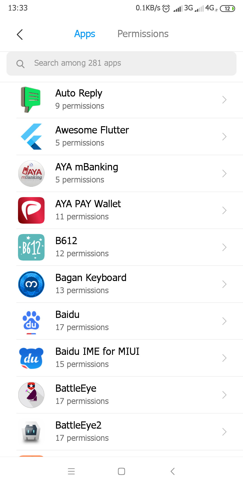
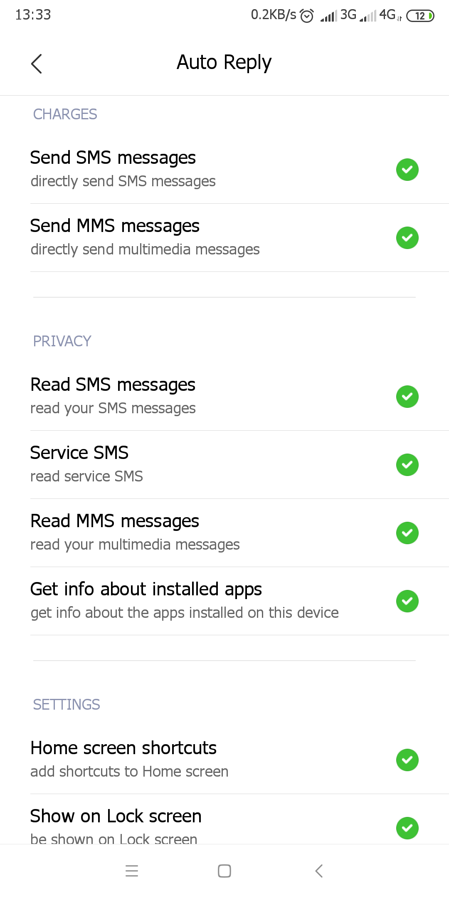
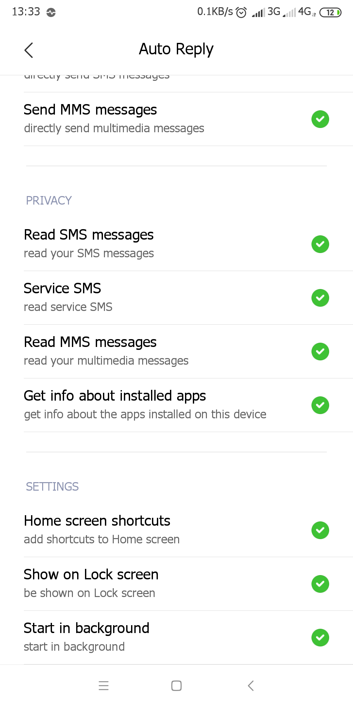

Google Pixel နဲ့ Honor မှာ အလုပ်လုပ်တဲ့ SMS_RECEIVED INTENT ဟာ MIUI သုံးထားတဲ့ Mi ဖုန်းမှာ အလုပ်မလုပ်ဘူး ဖြစ်နေတာ။

Permission ပြဿနာဆိုပါတော့။

ဒီတော့ 
Setting -> Permission -> App ထဲကို သွားပြီး ကိုယ့် App က တောင်းသမျှ permission တွေ အကုန်ဖွင့်ပေးလိုက်တယ်။
နောက်ပြီး 
Setting -> Permission -> Auto Start ထဲကို သွားပြီး ကိုယ့် App ကိုလည်း auto start မယ်ဖြစ်ကြောင်းရွေးပေးလိုက်တယ်။

အဆင်ပြေသွားရော။

Dual Sim တော့ ရွေးလို့မရဘူး
Primary Sim ကနေပဲ ပို့လို့ရတယ်။
ပြဿနာတော့ မရှိ။

